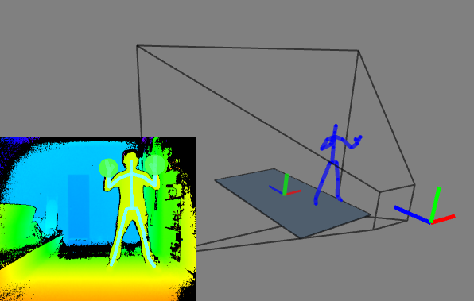
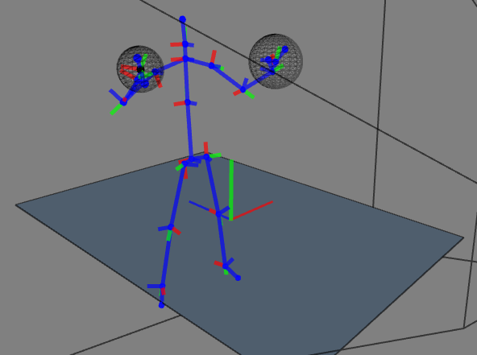

# Processing_KinectV2_SkeletonTools

This repository contains Processing Classes and Methods to preprocess KinectV2 Skeleton Data.

  

## Dependencies:
  1) "Kinect v2 for Processing" library - v0.7.8, by Thomas Sanchez Lengeling, found inside the Processing repository (IDE -> sketch -> import library);
  2) "oscP5" library - v0.9.9, by Andreas Schlegel, found inside the Processing repository (IDE -> sketch -> import library);
  3) "Jama" library - v1.0.3, included at this repository, and found at: https://math.nist.gov/javanumerics/jama/;

## Library features:
  1) Interface with KinectV2 using "Kinect v2 for Processing" library;
  2) Smooth skeleton;
  3) Calibrate for the floor position;
  4) Extract body features;
  5) Send features through network via OSC, using "oscP5" library;

## How to use
  Run the example main script "Processing_KinectV2_SkeletonTools.pde" to see it in action.
  - Create scene with `Scene scene = new Scene()`;
  - Call `scene.init()` at setup() method;
  - Call `scene.update()` in the draw() method;
  - Call `scene.drawOnScreen()` to see if it's working;
  - Press `f` to enter floor calibration routine. Follow the instructions and press `f` again when you are satisfied with calibration;
  - Acess each Skeleton feature with `skeleton.features.featureName`;
  - Send extracted features via OSC using the `communication` object;

## Detailed Information
### Smoothing algorithm:
  There is a physical model of the skeleton containing the connection strucure of the human body, shown at the [image](https://social.msdn.microsoft.com/Forums/en-US/f2e6a544-705c-43ed-a0e1-731ad907b776/meaning-of-rotation-data-of-k4w-v2) below. This model tries to implement temporal coherence over the skeleton movement, by keeping track of each joint linear velocity, bone angular velocity and bone length.

  

  The algorithm updates this physical model over time. Each new measurement of the sensor receives a confidence factor based on its "trackingState" information (from Kinect). This confidence factor sets how much this new measurement will get considered in the new estimated position.

  Getting in more detail: The human body Center of Mass is right on the "spineMid" joint, so the smoothing altorithm starts updating from this joint. It predicts the currentEstimatedPosition based on the previousEstimatedPosition, estimatedVelocity and currentMeasurement. Next step is to update its adjacent bones: estimate the boneLength and its orientation based on the previousEstimatedOrientation, angular velocity and current measurement. With these information, the next joint (at the other end of the bone) can be estimated. Each joints calls the next bone to be updated and each bone calls the next joint to be updated. This cycle repeats until the skeleton is fully estimated.

  

    
  

  A snapshot of the result is above, where each joint coordinate system is shown. The informations about the hand states are converted to a single float value representing "how much the hand is opened", in percentage (0 to 1). This information is drawn as a sphere around each hand.

### Floor calibration algorithm:
  Due to possible physical limitations of the environment, the Kinect sensor might be placed on different position/orientation each time it is used. A robust system would have to compensate for this variation. The proposed method is to calibrate the floor position and orientation before using the sensor, so that all the features can be calculated in relation to this new coordinate system. The calibration process goes as follows:

  Stand up in front of the sensor until your skeleton is tracked. Clap your hands to get a snapshot of your feet positions. Walk to a new spot, and clap your hands again. Repeat until there is enough data points (pink dots in the image below).

  

    
  

  A transparent box encompasses all data points, therefore representing the room limits. The estimated floor plane minimizes the sum of distances to the data points. This was acheived applying a Singular Value Decomposition to find the Principal Components of the 3D coordinates. Finally, the floor coordinate system is placed at the room center.

### Body Features:
  - [x] Position, velocity, acceleration and orientation of each joint relative to the Kinect Coordinate System
  - [x] Position, velocity, acceleration and orientation of each joint relative to the Floor Coordinate System
  - [x] Bone Relative Rotations - Roll, Pitch, Yaw. (Rotation from parent joint to child joint).
  - [x] Imaginary Steering Wheel
  - [ ] add list of desired features

  

    

    Some text.
    

    

    <!--  -->
    
    

  

